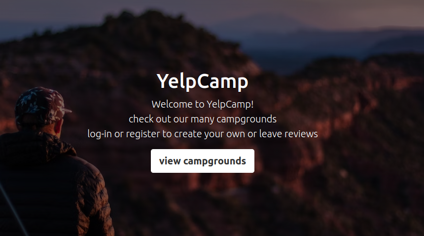

# yelp-camp

A website to review campgrounds. Users can post campgrounds they have visited, view other campgrounds, and leave reviews.



## demo app

This website is deployed and hosted on Heroku <a href="https://yelp-camp-portfolio.herokuapp.com">here</a>.

### credentials to quickly test the app

username - testuser<br />
password - testpassword

## setup

To use this app locally, please enter the following commands in a terminal.

```
git clone https://github.com/aleckondichook/yelp-camp
cd yelp-camp
npm install
npm run dev
```

## tech stack

<table>
  <thead>
    <tr>
      <th>Front End</th>
      <th>Back End</th>
      <th>Libraries</th>
    </tr>
  </thead>
  <tbody>
    <tr>
      <td>Javascript</td>
      <td>Node</td>
      <td>Express</td>
    </tr>
    <tr>
      <td>EJS</td>
      <td>MongoDB</td>
      <td>Bootstrap</td>
    </tr>
  </tbody>
</table>
